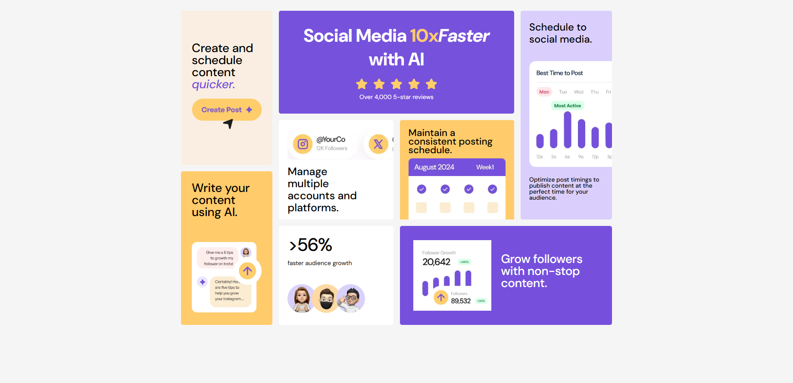

<h1 align="center"> Bento 💻 </h1>

## Status 🔧

Unsure.

## Requirements 📄

These are the requirements for this project from frontendMentor challenges:

- View the optimal layout for the interface depending on their device's screen size

## Alerts ⚡

- > [FrontendMentor Challenge Page](https://www.frontendmentor.io/challenges/bento-grid-RMydElrlOj)

- > [Live Project Link](https://bentog.netlify.app)  

## Goal 📌

- Build projects for my angular portfolio.
- Practice CSS GRID.

---

<h3 align="center"> Home 📷 </h3>

    

<h3 align="center"> Tecnologias utilizadas 🤖 </h3>

> 

>   
>   
> 

